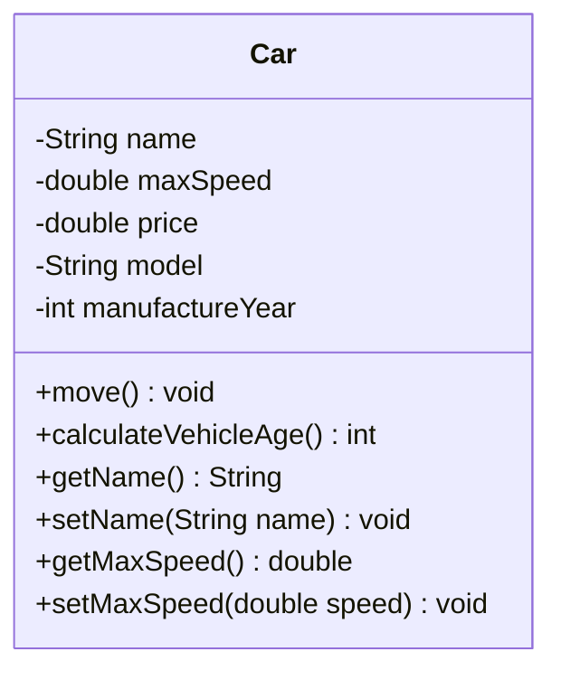

# Object-Oriented Programming (OOP)

Object-oriented programming is a methodology or paradigm to design a program using classes and objects.

## Advantages of OOP
- Reusability
- Readability
- Performance
- Space efficiency

## Java and OOP
Java is a powerful and widely-used programming language that fully supports OOP principles.

## Other Programming Methodologies
- **Procedural programming**: Used by C, Pascal, COBOL, FORTRAN, Java, Python, C++ etc.
- **Event-driven programming**: Used by C#, Visual Basic, Visual C++ and Java.

## Objects in OOP
- Fundamental building blocks in object-oriented programming
- Play a crucial role in the design and implementation of systems
- An object (or instance) is an executable copy of a class

### Object Composition
Objects in OOP are composed of two essential members:
1. **Data** (properties or attributes)
2. **Operations** (methods or functions or behaviors)

These elements encapsulate the state and behavior of the object, respectively, and work together to represent real-world entities within a software system.

## Car Example
Let's explore the car example to better understand these concepts:

### Attributes
- **Name**: Represents the brand or manufacturer of the car
- **Max Speed**: Indicates the maximum speed the car can achieve
- **Price**: Denotes the cost or price of the car
- **Model**: Represents the specific model or version of the car

### Operations
- **move()**: Represents the action of moving the car (may involve starting the engine, accelerating, braking, and steering)
- **calculateVehicleAge()**: Calculates the age of the car based on its manufacturing year or model year

### Getters and Setters
- **get()**: Getter methods retrieve the current value of an attribute
- **set()**: Setter methods modify or update the value of an attribute

These methods allow external code to access and modify the state of the car object in a controlled manner, promoting encapsulation and data integrity.

## Class Diagrams
The class diagram is a graphical representation of the structure and relationships of classes in a software system. It visually depicts:
- Classes
- Their attributes
- Methods
- Associations with other classes

Class diagrams provide a high-level overview of the system's architecture and help developers understand the relationships between different components.

- Car Class Diagram Example

## Classes in OOP
A class is a blueprint or template or prototype that defines the structure and behavior of objects. Key characteristics:
- Serves as a blueprint for creating objects with similar characteristics and functionalities
- Encapsulates data (attributes) and operations (methods) into a single unit
- Provides a modular and reusable way to model real-world entities within a software system
